<picture>
  <source media="(prefers-color-scheme: dark)" srcset="assets/dark.jpeg">
  <source media="(prefers-color-scheme: light)" srcset="assets/light.jpeg">
  
</picture>

  <picture>
  <source media="(prefers-color-scheme: dark)" srcset="https://readme-typing-svg.herokuapp.com?font=Fira+Code&duration=1000&pause=1000&color=F7F7F7&center=true&random=false&width=435&lines=Hello%2C+I+am+Jonathan+Lys;Welcome+to+my+repo!">
  <source media="(prefers-color-scheme: light)" srcset="https://readme-typing-svg.herokuapp.com?font=Fira+Code&duration=1000&pause=1000&color=304076&center=true&random=false&width=435&lines=Hello%2C+I+am+Jonathan+Lys;Welcome+to+my+repo!">
  
  </picture>

👨‍💻 I am a second-year PhD student at IMT Atlantique in the [BRoader Artificial Intelligence (BRAIN)](http://recherche.imt-atlantique.fr/brain/) team. My research interests include deep learning, computer vision, and natural language processing, with a focus on diffusion based generative models.

---

## How to reach me 📫

## My stats 📊

<picture>
  <source media="(prefers-color-scheme: dark)"  srcset="https://github-readme-stats.vercel.app/api/top-langs/?username=jonathanlys01&layout=compact&theme=github_dark_dimmed&langs_count=10">
  <source media="(prefers-color-scheme: light)" srcset="https://github-readme-stats.vercel.app/api/top-langs/?username=jonathanlys01&layout=compact&theme=swift&langs_count=10">
  
</picture>

---

```mermaid
    timeline
      title My education 🎓
        section IMT Atlantique <br> ⏤⏤⏤⏤⏤⏤⏤⏤ <br> Engineering school <br> (2021 - 2024)
          University of Technology Sydney : Academic exchange <br> (02/2023 – 06/2023)
          Université de Rennes 1 : SiVOS Master <br> (2023-2024)
```

1. [MSc. in Engineering "Diplôme d'Ingénieur"](https://www.imt-atlantique.fr/en/study/engineering)
2. [UTS Study Abroad program](https://www.uts.edu.au/study/international/study-abroad-and-exchange-uts)
3. [SiVOS MSc. (fr)](https://istic.univ-rennes.fr/master-2-spia-parcours-signal-vision-ondes-systemes-sivos)

<!--
**jonathanlys01/jonathanlys01** is a ✨ _special_ ✨ repository because its `README.md` (this file) appears on your GitHub profile.

Here are some ideas to get you started:

- 🔭 I’m currently working on ...
- 🌱 I’m currently learning ...
- 👯 I’m looking to collaborate on ...
- 🤔 I’m looking for help with ...
- 💬 Ask me about ...
- 📫 How to reach me: ...
- 😄 Pronouns: ...
- ⚡ Fun fact: ...
-->
